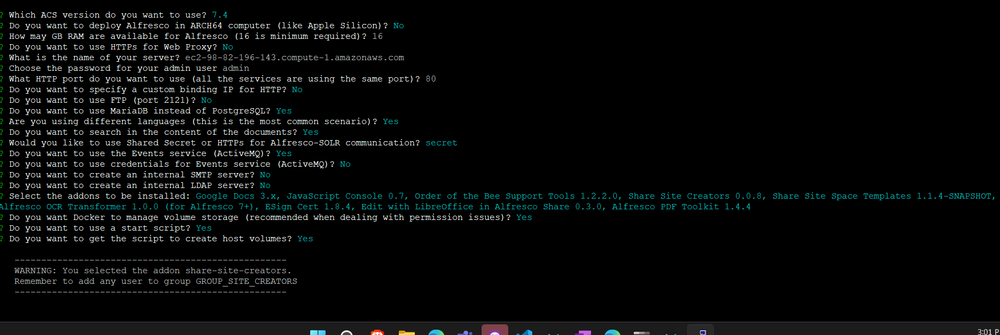
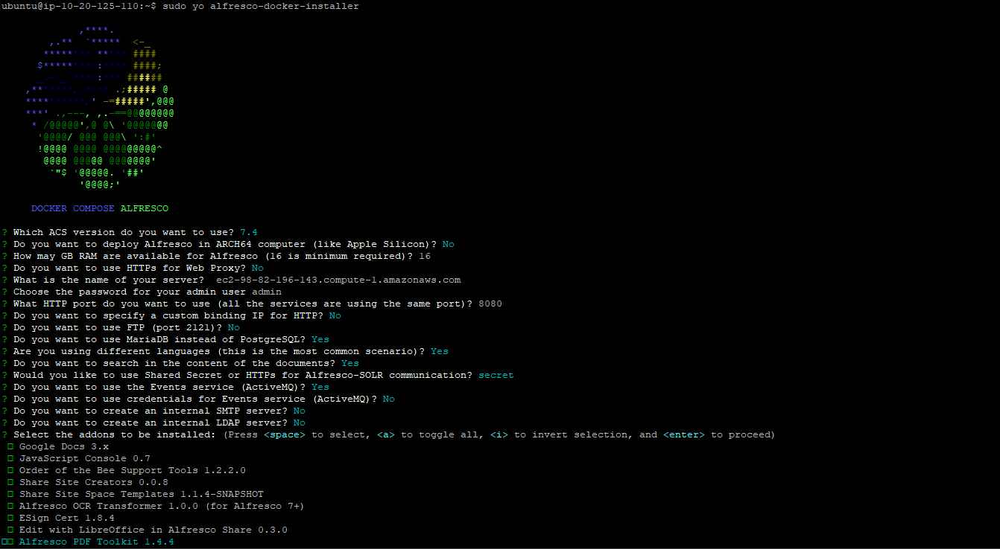
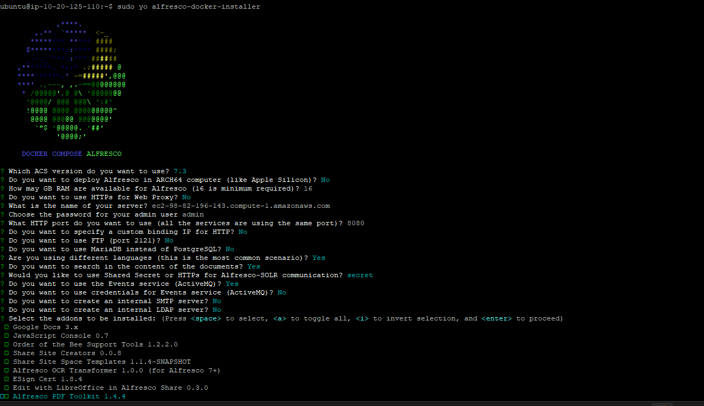
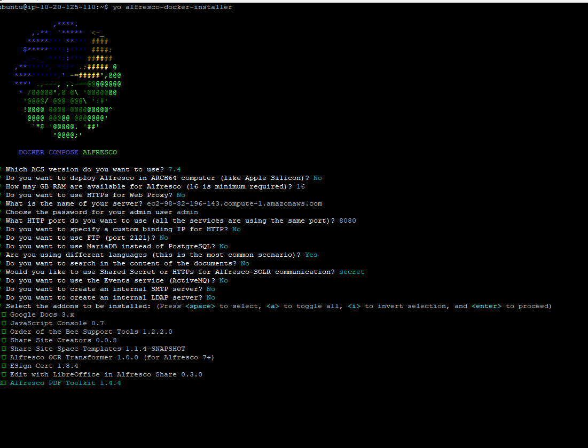

# Installing Alfresco

Video Guide: [Installing Alfresco Community 6 in Ubuntu with Docker Compose](https://www.youtube.com/watch?v=E_fvnlu3Lg0&ab_channel=AngelBorroy)

Github:

[Alfresco/alfresco-docker-installer: Generator to build Docker Compose templates to deploy Alfresco Community](https://github.com/Alfresco/alfresco-docker-installer)

1) install docker and docker compose.

2) install nodejs

3) install : 
   
   ```shell
   npm install -g yo
   ```


4. install:
   
   ```shell
   $ npm install --global generator-alfresco-docker-installer
   ```

5. export the module:
   
   ```bash
   # macOS, Linux and Windows Git Bash
   export NODE_OPTIONS=--openssl-legacy-provider
   ```

6. yo alfresco-docker-installer


- the SOLR: is the search functionality of the alfresco and it depends on scret to talk to alfresco service running in other container.

- similarly ActiveMQ is service which is Queue like sqs. It has credentials for authentication and security of the messages where we can access them only with the username and password.

- for add on service use the space bar to select all the different services.

- do you want docker to manage volume storage ( recommencded when dealing with permission issue) : select **yes**






ec2-98-82-196-143.compute-1.amazonaws.com






---

make change in the docker compose to add the volume in each of the stage.


[Customisation Guidelines | ACS Deployment Documentation](https://alfresco.github.io/acs-deployment/docs/docker-compose/examples/customisation-guidelines.html)


- sudo docker compose -f community-compose.yaml up -d

```yaml
# community-compose.yaml
#-----------------------------------------------------------------------#

# This Docker Compose file will spin up an ACS community installation on a local host.
# It requires at least 6GB of memory available to distribute among containers.

# For performance tuning, increase each container mem_limit and give a percentage of
# it to the JVM. Use either the -Xms,-Xmx flags or the newly added flags in
# java 10+: -XX:MaxRAMPercentage and -XX:MinRAMPercentage.
# More details here:
# https://www.oracle.com/technetwork/java/javase/10-relnote-issues-4108729.html
#
services:
  alfresco:
    image: docker.io/alfresco/alfresco-content-repository-community:25.1.0
    mem_limit: 1900m
    volumes:
      - alfresco_data:/usr/local/tomcat/alf_data
    environment:
      JAVA_TOOL_OPTIONS: >-
        -Dencryption.keystore.type=JCEKS
        -Dencryption.cipherAlgorithm=DESede/CBC/PKCS5Padding
        -Dencryption.keyAlgorithm=DESede
        -Dencryption.keystore.location=/usr/local/tomcat/shared/classes/alfresco/extension/keystore/keystore
        -Dmetadata-keystore.password=mp6yc0UD9e
        -Dmetadata-keystore.aliases=metadata
        -Dmetadata-keystore.metadata.password=oKIWzVdEdA
        -Dmetadata-keystore.metadata.algorithm=DESede
      JAVA_OPTS: >-
        -Ddb.driver=org.postgresql.Driver
        -Ddb.username=alfresco
        -Ddb.password=alfresco
        -Ddb.url=jdbc:postgresql://postgres:5432/alfresco
        -Dsolr.host=solr6
        -Dsolr.port=8983
        -Dsolr.http.connection.timeout=1000
        -Dsolr.secureComms=secret
        -Dsolr.sharedSecret=secret
        -Dsolr.base.url=/solr
        -Dindex.subsystem.name=solr6
        -Dshare.host=localhost
        -Dshare.port=8080
        -Dalfresco.host=localhost
        -Dalfresco.port=8080
        -Dcsrf.filter.enabled=false
        -Daos.baseUrlOverwrite=http://localhost:8080/alfresco/aos
        -Dmessaging.broker.url="failover:(nio://activemq:61616)?timeout=3000&jms.useCompression=true"
        -Ddeployment.method=DOCKER_COMPOSE
        -DlocalTransform.core-aio.url=http://transform-core-aio:8090/
        -XX:MinRAMPercentage=50
        -XX:MaxRAMPercentage=80
    healthcheck:
      test: ["CMD", "curl", "-f", "http://localhost:8080/alfresco/api/-default-/public/alfresco/versions/1/probes/-ready-"]
      interval: 30s
      timeout: 3s
      retries: 5
      start_period: 1m
    extends:
      file: commons/base.yaml
      service: alfresco
  transform-core-aio:
    image: alfresco/alfresco-transform-core-aio:5.1.7
    mem_limit: 1536m
    environment:
      JAVA_OPTS: >-
        -XX:MinRAMPercentage=50
        -XX:MaxRAMPercentage=80
    ports:
      - "8090:8090"
    healthcheck:
      test: ["CMD", "curl", "-f", "http://localhost:8090/ready"]
      interval: 20s
      timeout: 2s
      retries: 3
      start_period: 10s
    depends_on:
      activemq:
        condition: service_healthy
  share:
    image: docker.io/alfresco/alfresco-share:25.1.0
    mem_limit: 1g
    environment:
      CSRF_FILTER_ORIGIN: http://localhost:8080
      CSRF_FILTER_REFERER: http://localhost:8080/share/.*
      REPO_HOST: "alfresco"
      REPO_PORT: "8080"
      JAVA_OPTS: >-
        -XX:MinRAMPercentage=50
        -XX:MaxRAMPercentage=80
        -Dalfresco.host=localhost
        -Dalfresco.port=8080
        -Dalfresco.context=alfresco
        -Dalfresco.protocol=http
    healthcheck:
      test: ["CMD", "curl", "-f", "http://localhost:8080/share"]
      interval: 20s
      timeout: 2s
      retries: 3
      start_period: 15s
    depends_on:
      alfresco:
        condition: service_healthy
    extends:
      file: commons/base.yaml
      service: share
  postgres:
    image: postgres:14.4
    mem_limit: 512m
    volumes:
      - postgres_data:/var/lib/postgresql/data
    environment:
      - POSTGRES_PASSWORD=alfresco
      - POSTGRES_USER=alfresco
      - POSTGRES_DB=alfresco
    command: postgres -c max_connections=300 -c log_min_messages=LOG
    ports:
      - "5432:5432"
    healthcheck:
      test: ["CMD-SHELL", "pg_isready -d $$POSTGRES_DB -U $$POSTGRES_USER"]
      interval: 10s
      timeout: 3s
      retries: 3
      start_period: 5s
  solr6:
    image: docker.io/alfresco/alfresco-search-services:2.0.15
    mem_limit: 2g
    volumes:
      - solr_data:/opt/alfresco-search-services/data
    environment:
      # Solr needs to know how to register itself with Alfresco
      SOLR_ALFRESCO_HOST: "alfresco"
      SOLR_ALFRESCO_PORT: "8080"
      # Alfresco needs to know how to call solr
      SOLR_SOLR_HOST: "solr6"
      SOLR_SOLR_PORT: "8983"
      # Create the default alfresco and archive cores
      SOLR_CREATE_ALFRESCO_DEFAULTS: "alfresco,archive"
      # HTTPS or SECRET
      ALFRESCO_SECURE_COMMS: "secret"
      # SHARED SECRET VALUE
      JAVA_TOOL_OPTIONS: >-
        -Dalfresco.secureComms.secret=secret
    ports:
      - "8083:8983" # Browser port
  activemq:
    image: alfresco/alfresco-activemq:5.18-jre17-rockylinux8
    mem_limit: 1g
    volumes:
      - activemq_data:/opt/activemq/data
    ports:
      - "8161:8161" # Web Console
      - "5672:5672" # AMQP
      - "61616:61616" # OpenWire
      - "61613:61613" # STOMP
    healthcheck:
      test: ["CMD", "/opt/activemq/bin/activemq", "query", "--objname", "type=Broker,brokerName=*,service=Health", "|", "grep", "Good"]
      interval: 10s
      timeout: 5s
      retries: 5
      start_period: 5s
  content-app:
    image: alfresco/alfresco-content-app:6.0.0
    mem_limit: 128m
    environment:
      APP_BASE_SHARE_URL: "http://localhost:8080/aca/#/preview/s"
    healthcheck:
      test: ["CMD", "curl", "-f", "http://localhost:8080/"]
      interval: 10s
      timeout: 1s
      retries: 3
      start_period: 1s
    extends:
      file: commons/base.yaml
      service: content-app
  control-center:
    image: quay.io/alfresco/alfresco-control-center:9.4.0
    mem_limit: 128m
    environment:
      APP_CONFIG_PROVIDER: "ECM"
      APP_CONFIG_AUTH_TYPE: "BASIC"
      BASE_PATH: ./
    healthcheck:
      test: ["CMD", "curl", "-f", "http://localhost:8080/"]
      interval: 10s
      timeout: 1s
      retries: 3
      start_period: 1s
    extends:
      file: commons/base.yaml
      service: control-center
  proxy:
    extends:
      file: commons/base.yaml
      service: proxy
volumes:
  alfresco_data:
    driver: local
  postgres_data:
    driver: local
  solr_data:
    driver: local
  activemq_data:
    driver: local


```


